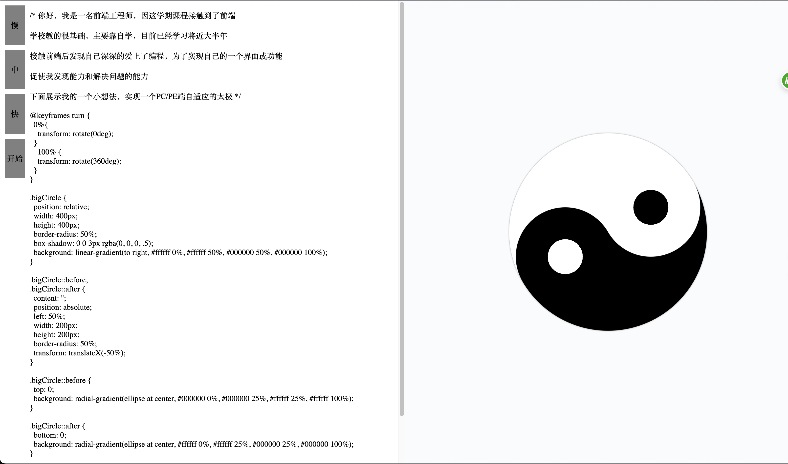

# Auto Taiji

English | [中文](./README_zh-CN.md)

## Preview

[https://layouwen.github.io/auto-taiji](https://layouwen.github.io/auto-taiji)

## Introduction

Simulate automatic code writing and real-time preview effects using JavaScript + CSS.  
This project combines CSS animations, DOM manipulation, string concatenation, pseudo-elements, and more.  
It's perfect for beginners to explore and learn. Simple examples will help you quickly understand and learn.

## Features

- Three speed options (slow, medium, fast) are available, with medium as the default.
- PC: Left-right layout, switches to top-bottom layout automatically when the width is less than 1024px.
- Mobile: Default top-bottom layout, supports most models in both landscape and portrait orientations. Some notch screens are not yet supported, awaiting updates.

## Contact Me

[Github](https://github.com/Layouwen)