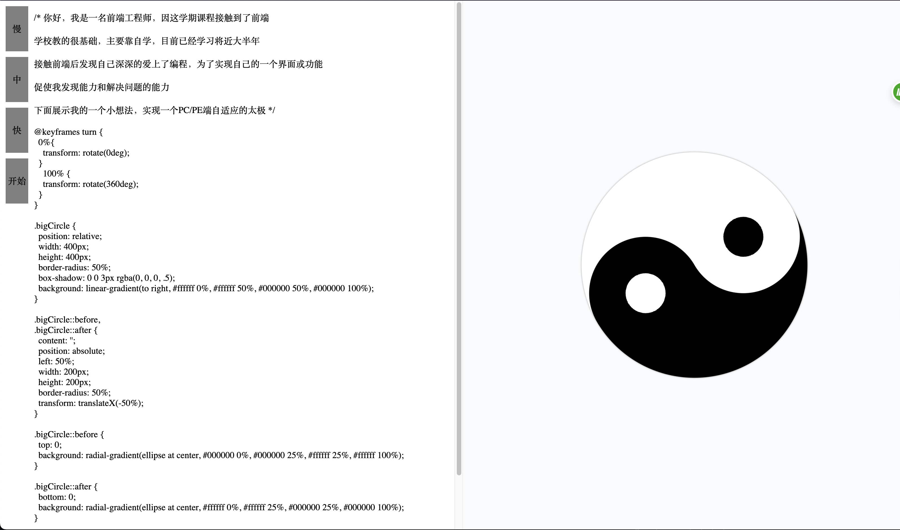

# 自转太极

[English](./README.md) | 中文

## 预览

[https://layouwen.github.io/auto-taiji](https://layouwen.github.io/auto-taiji)

## 介绍

使用 JavaScript + CSS 模拟自动写入代码, 即时预览的效果.
本项目综合了 CSS 动画、DOM 操作、字符串拼接、伪元素等.
十分适合初学者学习尝鲜。简单的例子让你快速了解并学习.

## 功能

- 可切换三挡速度（慢，中，快），默认为中等速度。
- PC 端 左右布局，宽度小于 1024px 自动切换为上下布局
- 手机端 默认上下布局，支持大部分型号 横屏 / 竖屏 显示，部分刘海屏还未适配，等待更新

## 联系我

[Github](https://github.com/Layouwen)